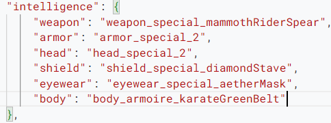
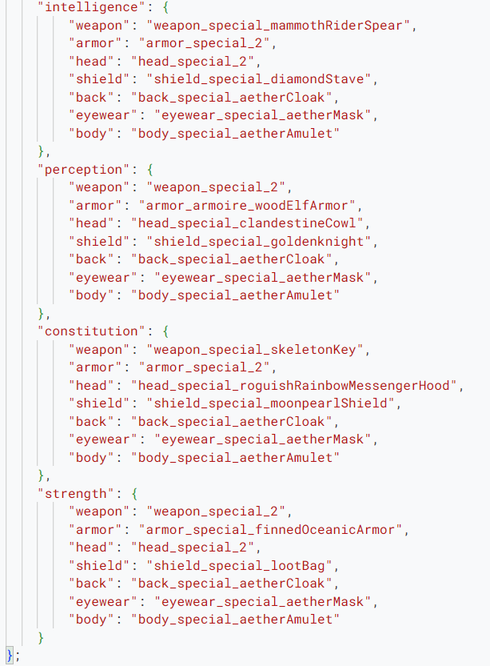

go to https://script.google.com/home

click new project

give it a name whatever you want

in the code.gs remove all existing code
and paste the code from equipment_switcher.gs

now you have to fill in the details. for that first go to https://habitica.com/user/settings/siteData

from there copy the User ID and API Token and paste them in the script where they are needed. for getting you the api token you may need to click on the learn more beside the api token field.

then if you want to receive email for everytime the script runs turn SEND_LOG_EMAIL to "true" otherwise keep  it false. then if you want to recieve the emails in a different email other than the one you are currenly on the website specify that email inthe EMAIL_ADDRESS

if you leave it blank it will use the currently email you are loggin with.

then click on the blue deploy button click new deployment then click on the gear icon to configure deployment. select web app. then in the who has access field set "Anyone" and click deploy. you will see a blue Authorize acess button click it. select the gmail you want to use. you will see a warning saying google hasn't verified this app. don't worry this script is safe. but just for your peace of mind you can copy and paste the script to any good ai like chatgpt or gemini or anything you like and ask it to verify that there is no malicious code in there. Now click Advanced then click on "Go to $projectname (unsafe)" in place of projectname you will see the name you gave the script. then it will ask you for permissions. select all and then continue. You may see this page is not working or Bad request error 400. don't worry. close it. you will see the deployment updating. after that you will see a screen where it says deployment successfully updated. here you will see a link under web app. copy this link. click done. paste this link in the WEB_APP_URL. save the script.

now you have to do some manual labor. you have to manually equip the equipment. like say you want to fill out the intelligence build then you have to open a new tab go to habitica and manually equip them gear then come back to this tab and run some funcitons. on the top beside run and debug you will see a another thing ther is a dropdown. click it.select setupWebhook. and then press run. press on review permissons select your email. click advanced go to $projectname(unsafe) then continue again continue. on the execution log you will see Webhook Connected! Status: 201
Habitica is now sending data to: $WeB_APP_URL. this sets up the webhook. after that click on the dropdown again. select getMyGearKeys run it. you will get somethinglike this:
{
  "weapon": "weapon_special_mammothRiderSpear",
  "armor": "armor_special_2",
  "head": "head_special_2",
  "shield": "shield_special_diamondStave",
  "eyewear": "eyewear_special_aetherMask",
  "body": "body_armoire_karateGreenBelt"
}

copy everything and paste them in the build like say "intelligence" it should look something like this:

in your case the values may be different based on what you equipped manually.

now we have to do this a few more times. based on how many presets you want. go to habitica manually equip the gears come back here run the getMyGearKeys function paste the data in the appropriate palces.
Mine looks somethinglike this:

remember this may different from yours because of what equipments you have or choose. 
then go to the drop down agian and select createBuildRewards and runit.

then click deploy then manage deployment click the pencil icon click on version click new version then click deploy click done.
